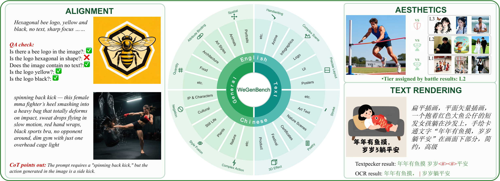

<h1 align="center">WeGenBench</h1>

---

<p align="center"><b>A Multidimensional Diagnostic Benchmark towards Text-to-Image Model Optimization</b></p>

<p align="center">
  <a href="https://arxiv.org/abs/2606.20100"></a>
  <a href="https://huggingface.co/yinggzhang/WeGenBench-Consistency-COT"></a>
</p>

WeGenBench is a multidimensional diagnostic benchmark for text-to-image (T2I) generation models. In contrast to evaluation protocols that report only a single aggregate score, WeGenBench provides both a curated set of **test prompts** and a suite of **interpretable evaluation methods**, characterizing model capability boundaries across general semantics, aesthetic quality, and visual text rendering. For every score, it further produces the corresponding judgment rationale (reasoning), enabling reliability verification of the evaluation results.

<p align="center">
  
</p>

---

## Overview

Existing T2I evaluations typically suffer from two limitations: they either measure overall semantics only at a coarse granularity, or they are confined to a single-scenario task. They are also predominantly English-centric, overlooking the differentiated challenges posed by different languages and cultures (e.g., the stroke-level precision required for Chinese characters and the complex typography of long English text). To address these issues, WeGenBench is organized around two complementary pillars, **test prompts** and **evaluation methods**:

- **Test prompts**: 4,000 prompts in total, divided into two major categories, **General** (general image scenarios) and **Text** (visual text rendering), with a strict Chinese–English balance (1,000 prompts for each "category × language" combination). Every prompt is annotated with a scenario category and multidimensional capability tags, supporting fine-grained, cross-dimensional capability diagnosis.
- **Evaluation methods**: A Vision-Language Model (VLM) is employed to assess generation quality along three core dimensions, while emitting an interpretable rationale for each score:
  - **Semantic Alignment**: QA-style verification (additive scoring) and Chain-of-Thought (CoT) deduction (subtractive scoring) complement each other to assess image–text consistency.
  - **Aesthetic Quality**: An anchor-based, level-wise comparative rating that mitigates VLM hallucination while keeping inference cost low.
  - **Visual Text Rendering**: A combination of OCR models and a VLM judges the spelling correctness and readability of the rendered text from multiple perspectives.

> Teaser illustration: the central wheel denotes the General / Text × Chinese / English scenario taxonomy; the left depicts semantic alignment (QA check and CoT), the upper right shows aesthetic-quality grading, and the lower right shows text rendering (TextPecker and OCR).

### Key Advantages

- **Fine-grained capability diagnosis**: Beyond scenario categories, each prompt is annotated with fine-grained, multidimensional capability tags, enabling testing and comparison of different models across more granular scenarios and capability dimensions, and precisely localizing their strengths and weaknesses.
- **Interpretable evaluation methodology**: The evaluation produces not only a score but also the corresponding judgment rationale (reasoning) for each score, helping users reasonably assess the accuracy and validity of a model's ratings rather than blindly trusting a single number.

This repository releases the WeGenBench **prompt dataset**, together with **reference code** for the four evaluation methods: CoT consistency scoring, QA-style consistency scoring, aesthetic-quality scoring, and visual text rendering scoring.

### Repository Structure

```
.
├── data/
│   └── prompts/
│       ├── wegenbench_general_en.jsonl   # General prompts · English (1,000)
│       ├── wegenbench_general_cn.jsonl   # General prompts · Chinese (1,000)
│       ├── wegenbench_text_en.jsonl      # Text-rendering prompts · English text (1,000)
│       └── wegenbench_text_cn.jsonl      # Text-rendering prompts · Chinese text (1,000)
└── evaluation/
    ├── Consistency/                   # Semantic alignment (CoT + QA)
    │   ├── CoT/                        # CoT consistency scoring (subtractive)
    │   │   ├── model/checkpoint/        # Fine-tuned scoring model (Qwen3-VL-8B, full-parameter)
    │   │   └── demo/infer_demo.py       # Single-image inference reference code
    │   └── QA/                         # QA-style consistency scoring (additive)
    │       ├── questions/               # Weighted yes/no questions decomposed per prompt (1,000 each for ZH/EN)
    │       └── prompt/                  # VLM-judge prompts (ZH/EN)
    ├── Aes/                           # Aesthetic-quality scoring (levelwise anchor battle)
    │   ├── anchors/level_reason.json   # Per-level anchor rating templates (image_path left empty; anchors self-supplied)
    │   └── demo/infer_demo.py          # Single-image aesthetic-level reference code (self-contained)
    └── Text/                          # Visual text rendering scoring
        ├── recognition/eval_textpecker.py   # TextPecker text recognition
        └── scoring/
            ├── score_text.py                # Merging and scoring (self-contained)
            └── examples/                    # Example data
```

---

## Prompts

The test prompts are located in `data/prompts/`, divided into the General and Text categories, with 2,000 prompts each (Chinese–English balanced).

> Note: prompts may contain real brand, work, organization, or person names. These are included solely for academic evaluation purposes and do not imply any authorization or endorsement by the respective owners.

### General prompts: `data/prompts/wegenbench_general_{en,cn}.jsonl` (1,000 each)

Used for semantic alignment (CoT / QA) and aesthetic-quality evaluation. English samples (`en_*`) and Chinese samples (`cn_*`) are stored separately in `wegenbench_general_en.jsonl` and `wegenbench_general_cn.jsonl`, and share an identical schema:

| Field | Description |
|---|---|
| `id` | Sample identifier (`en_*` for English samples, `cn_*` for Chinese samples) |
| `prompt` | The prompt (English for English samples, Chinese for Chinese samples) |
| `style` | Style label (may be empty) |
| `tag` | List of multidimensional capability tags |
| `type` | Scenario category (one of 16 macroscopic scenarios; Chinese name for Chinese samples, English name for English samples) |
| `difficulty` | Difficulty level (integer 1–5, from low to high: L1 minimal → L5 extreme) |

### Text-rendering prompts: `data/prompts/wegenbench_text_{en,cn}.jsonl` (1,000 each)

Used for visual text rendering evaluation. Samples that render English text (`EN_*`) and Chinese text (`CN_*`) are stored separately in `wegenbench_text_en.jsonl` and `wegenbench_text_cn.jsonl`, and share an identical schema:

| Field | Description |
|---|---|
| `id` | Sample identifier (`CN_*` renders Chinese text, `EN_*` renders English text) |
| `prompt` | Generation prompt (English for English samples, Chinese for Chinese samples) |
| `text` | Target text to be rendered in the image (a list that may contain multiple segments, serving as the reference GT for scoring; the text itself may be Chinese / English / digits / symbols or their combinations) |
| `type` | Scenario category (one of 10 scenarios; Chinese name for Chinese samples, with an `-EN` suffix for English samples) |
| `tag` | List of multidimensional capability tags (covering scenario and text-rendering-related capability dimensions) |
| `difficulty` | Difficulty level (`Easy` / `Medium` / `Hard` / `Extreme`): first initialized by the longest text-segment length (<16 → Easy, 16–27 → Medium, 28–59 → Hard, ≥60 → Extreme), then promoted by one level each for "artistic-font hit" and "complex scene" (capped at `Extreme`) |

---

## Evaluation Methods

The four evaluation methods correspond to subdirectories under `evaluation/`. Each section below provides a **method overview**, a **usage** guide, and the **required external components** (i.e., external dependencies, data, or services that are not distributed with the repository and must be prepared by the user).

### Semantic Alignment (`evaluation/Consistency/`)

Semantic alignment adopts two complementary routes, both under `evaluation/Consistency/`: CoT deduction (subtractive scoring) and QA-style verification (additive scoring).

#### CoT consistency scoring (`evaluation/Consistency/CoT/`)

**Method overview**: A fine-tuned Qwen3-VL-8B scoring model performs CoT-based consistency evaluation on the «generated image + prompt» pair, outputting a 1–10 overall score, a holistic assessment, and itemized deductions (subtractive scoring).

**Usage** (single image):

```bash
cd evaluation/Consistency/CoT/demo
python infer_demo.py --image path/to/generated.jpg --prompt "A corgi running on the grass"
```

By default the model is loaded from the relative path `../model/checkpoint`, which can be overridden via `--ckpt`. Due to its size, the weights are not distributed with the GitHub repository: please first download the scoring model from [HuggingFace](https://huggingface.co/yinggzhang/WeGenBench-Consistency-COT) and place it under `evaluation/Consistency/CoT/model/checkpoint/` (or point `--ckpt` to a custom path).

**Required external components**:

- Runtime environment: [ms-swift](https://github.com/modelscope/ms-swift) (`pip install ms-swift`), together with `transformers>=4.57`, `qwen_vl_utils`, and `decord`. The model is a full-parameter Qwen3-VL-8B with bf16 weights of about 17GB; together with vision-encoder activations, the KV cache, and the relatively long CoT outputs, the **actual GPU memory requirement is approximately 24GB or more** (e.g., a single 24GB 3090 / 4090 / A10; 40GB or more is more comfortable).
- Scoring model weights: not distributed with the GitHub repository; download from [HuggingFace](https://huggingface.co/yinggzhang/WeGenBench-Consistency-COT) into `evaluation/Consistency/CoT/model/checkpoint/`.
- The generated images to be evaluated.

#### QA-style consistency scoring (`evaluation/Consistency/QA/`)

**Method overview**: Each prompt is decomposed into a set of weighted yes/no questions (with `weight` summing to about 100), which are then verified one by one by a VLM judge and aggregated by weight into a consistency score (additive scoring).

- Question set: `evaluation/Consistency/QA/questions/wegenbench_general_{zh,en}_questions.jsonl`, where each line contains `prompt`, `clean_prompt`, and `questions` (each question includes `question`, `type`, and `weight`).
- Judge prompts: `evaluation/Consistency/QA/prompt/ans-check-questions{,-en}.txt`, which constrain the VLM to output only `1` (yes) or `0` (no) for each question.

**Usage** (overall pipeline): For each image to be evaluated, submit the corresponding questions one by one to the VLM-judge service following the judge prompt; after obtaining the `1 / 0` results, compute the weighted average by each question's `weight` to obtain the QA consistency score for that image.

**Required external components**:

- A VLM-judge service (OpenAI-compatible API; the paper uses Qwen3.5-397B-A17B-FP8).
- The generated images to be evaluated.
- A QA scoring driver script: this repository currently provides only the question set and the judge prompts, and does not yet include a script that connects "question set + image + judge service" into an end-to-end scorer; this needs to be implemented by the user (see the pipeline above).

### Aesthetic-quality scoring (`evaluation/Aes/`)

**Method overview**: A levelwise anchor battle estimates the aesthetic level (L0–L5) of a generated image. The «image under evaluation + 3 anchor images of the same level» are tiled into a 2×2 grid, and a VLM judges whether the image is below / meets / above the baseline of that level; starting from L3, it probes upward (L4→L5) or downward (L2→L1→L0) according to the voting result, and finally aggregates into an aesthetic level. By replacing direct scoring with comparative grading, this method mitigates VLM hallucination and reduces inference cost.

**Usage** (single image; anchors must be prepared in advance):

```bash
cd evaluation/Aes/demo
python infer_demo.py \
    --image path/to/generated.jpg --category human \
    --anchor_root /path/to/your/anchors \
    --vllm_host localhost --port 8000
```

The output includes the final aesthetic level L0–L5, the level interval, the structural ceiling, and the per-level voting details.

**Required external components**:

- An OpenAI-compatible VLM service (e.g., a multimodal model deployed with vLLM), specified via `--vllm_host` / `--port`.
- Anchor images: the repository provides `evaluation/Aes/anchors/level_reason.json` (containing the per-level `why_this_level` rating descriptions), but its `image_path` fields are left empty and the anchor images are not distributed with the repository. Before use, prepare your own per-level anchor images and fill in the corresponding `image_path` (relative to `--anchor_root`), or point to your own anchor set via `--anchor_json` / `--anchor_root` (or the environment variables `ANCHOR_JSON` / `ANCHOR_ROOT`).
- Python dependencies: `openai`, `pillow`.

### Visual text rendering scoring (`evaluation/Text/`)

**Method overview**: Two steps—first recognize the text in the image, then compute metrics against the GT text (edit similarity, sentence accuracy, character F1, etc.). The recognition step uses both a VLM route ([TextPecker](https://github.com/CIawevy/TextPecker); this work uses **TextPecker-8B-InternVL3**) and a conventional OCR route.

**Usage**:

Step 1 · TextPecker recognition (`recognition/eval_textpecker.py`):

```bash
export TEXTPECKER_ROOT=/path/to/TextPecker
python evaluation/Text/recognition/eval_textpecker.py \
    --input_jsonl your_data.jsonl --output_dir ./results/flux1 \
    --vllm_host localhost --port 1925 --resume
```

Step 2 · Scoring (`scoring/score_text.py`, depending only on `numpy` / `scipy`): compares the TextPecker and OCR recognition results against the GT text, computing metrics such as `pecker_qua` / `pecker_gned` / `pecker_char_F1` as well as `edit_sim` / `sen_acc` / `ocr_char_F1`. The repository provides reference code that requires no external service:

```bash
cd evaluation/Text/scoring
python score_text.py \
    --pecker examples/sample_pecker.jsonl \
    --ocr    examples/sample_ocr.jsonl \
    --output examples/metrics.json
```

You can also directly provide a single merged jsonl (each line containing both the pecker and ocr fields):

```bash
python score_text.py --input merged.jsonl --output metrics.json
```

**Required external components**:

- The TextPecker repository (which provides `parse_utils_pecker`, pointed to via `--textpecker_root` or the environment variable `TEXTPECKER_ROOT`), together with a vLLM-deployed TextPecker service (this work uses the **TextPecker-8B-InternVL3** model).
- OCR recognition results: provided by an external OCR service and not open-sourced in this repository. The scoring script only reads pre-computed OCR recognition results as input and does not call any OCR service itself; therefore, OCR recognition must be performed externally and saved as jsonl before use. `scoring/examples/sample_ocr.jsonl` provides an example of the expected result format.
- The generated images to be evaluated.

---

## Experimental Results

We conducted a systematic evaluation of a range of mainstream T2I models on WeGenBench, covering three major dimensions:

- **Alignments**: `QA` (QA verification pass rate, ↑) and `COT` (CoT subtractive score, 1–10, ↑).
- **Aesthetics**: `AM` (anchor-based level rating, 0–5, ↑).
- **Visual Text Rendering**: `Sim_edit` (normalized edit similarity), `Acc_sen` (sentence accuracy), `Score_qua` (typography quality and readability), `GNED` (generalized normalized edit distance), and `Char_F1` (character-level F1); higher is better for all.

> Evaluation notes: `QA / COT / AM` are evaluated on the 2,000-prompt General subset, and the five text-rendering metrics on the 2,000-prompt Text subset. For closed-source models, a small number of prompts fail to produce images due to safety and copyright filtering; such cases are still counted in the denominator based on successful samples. The automatic evaluation engine uses Qwen3.5-397B-A17B-FP8. In each column, **bold** indicates the best and <u>underline</u> the second best.

**Open-source models**

| Model | QA↑ | COT↑ | AM↑ | Sim_edit↑ | Acc_sen↑ | Score_qua↑ | GNED↑ | Char_F1↑ |
|---|---|---|---|---|---|---|---|---|
| GLM-Image | 0.86 | 6.23 | 2.58 | <u>0.73</u> | 0.56 | <u>0.92</u> | <u>0.74</u> | <u>0.78</u> |
| FLUX.2-dev | 0.93 | 7.91 | 2.69 | 0.51 | 0.38 | 0.76 | 0.55 | 0.58 |
| Qwen-Image | 0.91 | 7.44 | 2.56 | 0.45 | 0.33 | 0.61 | 0.43 | 0.46 |
| Qwen-Image-2512 | 0.90 | 7.43 | 2.70 | 0.62 | 0.43 | 0.72 | 0.57 | 0.59 |
| Z-Image | 0.92 | 7.65 | 2.44 | 0.50 | 0.53 | 0.78 | 0.52 | 0.55 |
| Z-Image-Turbo | 0.90 | 7.26 | 2.67 | 0.67 | 0.50 | 0.87 | 0.69 | 0.73 |
| HunyuanImage-3.0-Inst. (image) | 0.95 | 8.26 | 2.65 | 0.63 | 0.56 | 0.88 | 0.66 | 0.69 |
| HunyuanImage-3.0-Inst. (think_re.) | 0.95 | 8.32 | 2.74 | 0.56 | 0.56 | 0.90 | 0.57 | 0.63 |
| HunyuanImage-3.0-Inst.-D (image) | 0.93 | 8.00 | 2.62 | 0.66 | 0.50 | 0.85 | 0.67 | 0.70 |
| HunyuanImage-3.0-Inst.-D (think_re.) | 0.94 | 8.08 | 2.70 | 0.57 | 0.54 | 0.89 | 0.57 | 0.63 |
| Ernie-Image-Turbo (pe) | 0.92 | 7.72 | 2.59 | 0.60 | 0.56 | 0.90 | 0.61 | 0.65 |
| Ernie-Image-Turbo (no-PE) | 0.92 | 7.87 | 2.65 | 0.70 | 0.56 | 0.89 | 0.71 | 0.75 |
| SenseNova-U1-8B-MoT | 0.92 | 7.72 | 2.38 | 0.68 | 0.52 | 0.90 | 0.71 | 0.74 |
| SenseNova-U1-8B-MoT-think | 0.93 | 7.81 | 2.41 | 0.68 | 0.51 | 0.88 | 0.70 | 0.72 |
| HiDream-O1 | 0.87 | 6.11 | 2.30 | 0.49 | 0.54 | 0.78 | 0.56 | 0.57 |

**Closed-source models**

| Model | QA↑ | COT↑ | AM↑ | Sim_edit↑ | Acc_sen↑ | Score_qua↑ | GNED↑ | Char_F1↑ |
|---|---|---|---|---|---|---|---|---|
| GPT-Image-2 | **0.97** | **8.95** | **2.84** | 0.50 | <u>0.57</u> | 0.88 | 0.52 | 0.56 |
| Seedream-4.5 | 0.96 | <u>8.74</u> | <u>2.81</u> | **0.74** | **0.59** | **0.93** | **0.76** | **0.79** |
| Nano-banana-2 | <u>0.97</u> | 8.71 | 2.77 | 0.38 | 0.55 | 0.86 | 0.45 | 0.49 |

---

## License

This repository is released under a **dual-license** scheme that governs the code and the data separately:

- **Code** (all source code under `evaluation/`, etc.): [Apache License 2.0](LICENSE).
- **Dataset** (the prompts, text annotations, tags, and difficulty labels under `data/`): [CC BY-NC 4.0](data/LICENSE), i.e., free to share and adapt, but with required attribution (cite WeGenBench) and for **non-commercial use only**.
- **Scoring model**: released on [HuggingFace](https://huggingface.co/yinggzhang/WeGenBench-Consistency-COT) under the Apache-2.0 license (the base model is Qwen3-VL); see its model card for details.

Prompts may contain real brand, work, organization, or person names. These are included solely for academic evaluation purposes and do not imply any authorization or endorsement by the respective owners.

---

## Citation

If you find this work helpful for your research, please consider citing our paper:

```bibtex
@misc{liang2026wegenbenchmultidimensionaldiagnosticbenchmark,
      title={WeGenBench: A Multidimensional Diagnostic Benchmark towards Text-to-Image Model Optimization},
      author={Qian Liang and Xiaomin Li and Ying Zhang and Jia Xu and Lihao Ni and Hongrui Li and Jingjing Li and Jing Lyu and Chen Li},
      year={2026},
      eprint={2606.20100},
      archivePrefix={arXiv},
      primaryClass={cs.CV},
      url={https://arxiv.org/abs/2606.20100},
}
```

---

## Contact Us

If you have any questions or suggestions, feel free to reach out via GitHub Issues. We look forward to your feedback!
